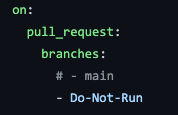
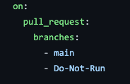

# Intro

**NOT** intended for production use. For demonstration purposes only 😊 .

This web app will allow you to search for any GitHub user by their handle!

## Getting Started

### Demo Flow
1. Create a new issue using the issue template: "Terraform Request - Azure App Service"
2. Fill out required JSON body object
3. Add a comment to the issue that includes the trigger string '/approved'
4. GitHub Action will kick off generating:
    - an Azure Resource Group, App Service plan and App Service (with deployment slots)
    - GitHub Environments (for UAT and STAGING - will include protection rules for STAGING)
5. Create an environment secret for the two generate environments with a value for the **AZURE_WEBAPP_PUBLISH_PROFILE** downloaded from the Azure App Service slots
5. Create a New PR, include in the JSON body the issue # from *step 4*
6. Deploy Container via PR workflow will trigger performing:
    - Issue Ops grabbing Azure resource values from the TF request Issue
    - Build and Test 
    - Build and Deploy to GHCR 
    - Deploying to UAT and STAGING Slots for Azure Web App
8. Close the Issue to perform an Azure Resource Teardown and deletion of the generated Environments and Deployments
### Generate Azure Service Principal
To deploy to Azure you will need to create a service principal. You can do that with the following command:

```sh
az ad sp create-for-rbac --name {yourServicePrincipalName} --role contributor \
                            --scopes /subscriptions/{subscription-id} \
                            --sdk-auth

  # Replace {yourServicePrincipalName}, {subscription-id} with the a service principal name and subscription id.

  # The command should output a JSON object similar to the example below

  {
    "clientId": "<GUID>",
    "clientSecret": "<GUID>",
    "subscriptionId": "<GUID>",
    "tenantId": "<GUID>",
    (...)
  }
```

### Generate Azure Service Principal for Policy Assignment

```sh
  az ad sp create-for-rbac --name {ServicePrincipalName} --role owner \
                              --scopes /subscriptions/{subscription-id} \
                              --skip-assignment false \
                              --sdk-auth
 ```

 *This service principal does the work but is probably way too powerful for what you need, you might want to consider reducing its privileges, check the [docs](https://docs.microsoft.com/en-us/cli/azure/create-an-azure-service-principal-azure-cli?view=azure-cli-latest) to know more!*
  
### Creating GitHub Secrets
Add the JSON output as the following secrets in the GitHub repository:

> `TF_VAR_agent_client_id` 

> `TF_VAR_agent_client_secret` 

> `TF_VAR_subscription_id` 

> `TF_VAR_tenant_id` 

For steps to create and storing secrets, please check [here](https://docs.github.com/en/actions/configuring-and-managing-workflows/creating-and-storing-encrypted-secrets)

These secrets are assigned in the workflow .yml files for the AzureRM Provider Argument References found [here](https://registry.terraform.io/providers/hashicorp/azurerm/latest/docs#argument-reference)

> `ARM_CLIENT_ID: ${{ secrets.TF_VAR_agent_client_id }}`

> `ARM_CLIENT_SECRET: ${{ secrets.TF_VAR_agent_client_secret }}`

> `ARM_SUBSCRIPTION_ID: ${{ secrets.TF_VAR_subscription_id }}`

> `ARM_TENANT_ID: ${{ secrets.TF_VAR_tenant_id }}`

## Run App Locally:

1. Fork/Clone Repo
2. Open in Codespaces or IDE of your choice
3. `npm install`
4. `npm run test`
5. `npm run dev`

## Run in container

1. `docker build --tag nodejs-demo .`
2. `docker run -p 8000:8000 nodejs-demo`

## Run from container image
1. `docker run -it -p 8000:8000 ghcr.io/octodemo/demoday-node:<tag> /bin/bash`

## Triggering Actions for Azure Deployment

1. Create a new branch
2. Introduce new commits
3. For the specific .yml workflow to run, update the comments in the `on:` section to include the `main` branch

   - 
   - 

4. Create a pull request to the main branch
5. Check the Actions tab, Pull Request, and Environments page as the workflow runs!

## Reference Material

- [Environments - GitHub Docs](https://docs.github.com/en/free-pro-team@latest/actions/reference/environments)
- [GitHub + Microsoft Teams Integration](https://github.com/integrations/microsoft-teams)

- [Deploy to App Service using GitHub Actions - Microsoft Docs](https://docs.microsoft.com/en-us/azure/app-service/deploy-github-actions?tabs=applevel)

- [Welcome to Codespaces - GitHub Universe 2020 YouTube](https://www.youtube.com/watch?v=j5VQ8OlwbqI&ab_channel=GitHub)

## Feedback?

Open a discussion thread in this repo!

Participate in our Support Community for Code-to-Cloud:

- https://github.community/c/code-to-cloud/52
